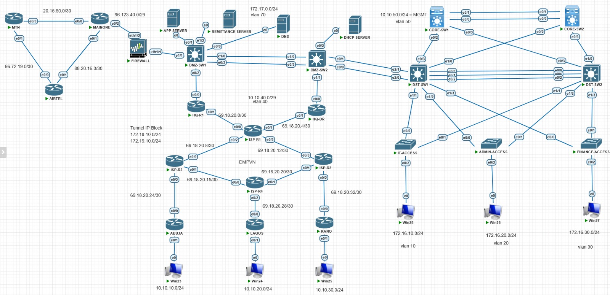

# Enterprise Networks and DMVNP Automated Configurations
## Project description
The Enhanced Interior Gateway Routing Protocol, or EIGRP, is a sophisticated routing protocol created by Cisco. It is used in large business networks because it works well, can handle big networks, and is dependable. EIGRP is different from older routing methods because it combines parts of both distance-vector and link-state protocols, making it a mix of features that works well for complex network setups. In this project, EIGRP is used as the main routing method for the business network because it quickly adjusts to changes, uses less bandwidth, and can work with different types of network data, like IPv4 and IPv6. EIGRP uses a special algorithm called DUAL to make sure there are no loops in the network and to speed up the process of updating routes when the network changes. Some important things about how EIGRP is used in this project include: Using Bandwidth Wisely: EIGRP only sends out updated information when there are changes, which means it doesn’t waste network resources. Handling Big Networks: It can manage large networks and is good for networks that are organized in levels or parts. Sharing Workload: It can spread traffic across multiple paths, both when the paths are the same and when they are different, which helps the network work better. Quick Adjustments: Because of DUAL, EIGRP can update the best paths quickly, which means the network stays up and running without long interruptions. Adaptable: It supports Variable Length Subnet Masks and route summarization, which helps in using IP addresses more efficiently.
In this project EIGRP was configured as routing protocol which made the transmission of traffics between the routers and to the users computers possible.

The Dynamic Multipoint Virtual Private Network, or DMVPN, is a scalable, secure, and cost-efficient VPN solution created by Cisco. It makes it easier to set up secure connections between several remote locations. Traditional VPN setups use fixed, one-to-one connections, but DMVPN uses a dynamic hub-and-spoke structure. This setup makes it simpler to configure and more adaptable. This project looks at how to design, set up, and test DMVPN as a way to meet current business network requirements. It examines how DMVPN uses various technologies like:
•	mGRE (Multipoint GRE tunnels) – allowing a single GRE tunnel interface to connect multiple remote sites dynamically.
•	NHRP (Next Hop Resolution Protocol) – enabling spokes to register with the hub and discover each other for direct communication.
•	IPsec encryption – ensuring secure data transfer over the public internet.
In this project the DMVPN technology was configured and used to connect the remote branches of a company to the headquarters data center.

The Border Gateway Protocol (BGP) is the main protocol used to share information about how to route data between different groups of networks, called autonomous systems (AS), on the Internet. It is different from other types of routing protocols because it is built to work across the entire Internet. BGP helps Internet Service Providers (ISPs) handle their routing rules, manage how traffic flows, and connect to other networks smoothly. This project looks into how BGP is designed, set up, and used in an ISP setting. In this project , BGP was configured between three Internet Service Providers namely MAINONE, MTN and AIRTEL for accessing internet service, however the control on those routers belonging to the trio were not given to us . BGP was also configured in ISP1, ISP2, ISP3 and ISP4 which stand for different Internet Service Providers they provide connectivities so DMVPN could be configured at the diffferent locations of the Cyberspace offices and the same technology is used to connect and give services to different clients and we have full controls on them.

This readme file contains the entire automated configurations of the DMVPN and the Enterprise networks in the diagram.  

## Aim
- The aim of this project is to configure and implement different network technologies using automation

## Objectives
- To configure routers using automation methods
- To configure network distribution layer switches using automation 
- To automate the configurations of network Core layer switches using automation
- To automate the configurations of network access layer switches using automation
- To configure routing protocol such as Extended Interior Gateway Routing Protocol (EIGRP) using automation
- To automate the configurations of routing protocol such as Border Gateway Protocol (BGP)
- To automate the connfigurations of Dynamic Multipoints Virtual Private Networks (DMVPN)
- 

## Tools/devices
 - Pnet emulator was used to design and configure the network
 - Router : It routes or transmits traffics between different network segments.
 - Core switch: It handles the backbone or core of the network , it carries out faster   switching of data.
 - Distribution switch : It situated between the core and the access layer switch for proper distribution of data and redundancy connection between the access and the core switches
 - Access Layer switch : This is situated at the lowest layer of the lowest layer of the network ,it accomodated the users and allows them to connect and interface with the network
 - Firewall : It helps to create rules in the network for security purposes
 - Servers : it is used for different purposes in the network such as DHCP , Applications, DNS etc. 
 - vscode was used for the script writing
 ## Devices Configurations location
 
## OutCome
By running the script , the devices would be contacted using their ip addresses and the hostname and the configurations files would be picked and push to the target devices and the jobs which could take hours or days to complete would be done within minutes.
# NB:
The devices such as users workstations (P),servers and firewall are runing operating systems which did not allow their configurations to be dispayed here becuase this is just an emulated or simulator . However the major targets are the routers and the switches configurations which are the major devices in this project prototype.
I was able to present this prototype becuase I played a leading roles in implementing this project in Cyberspace Limited in Nigeria in  2021. I would not be able to showcase more than this about the project based on the companys intellectual property policies. 
All the configurations files , script, topology , README  are all sited in my local computer and all of them are push into my github and could be located following this link : https://github.com/sankemsan/Network_Config_Automation